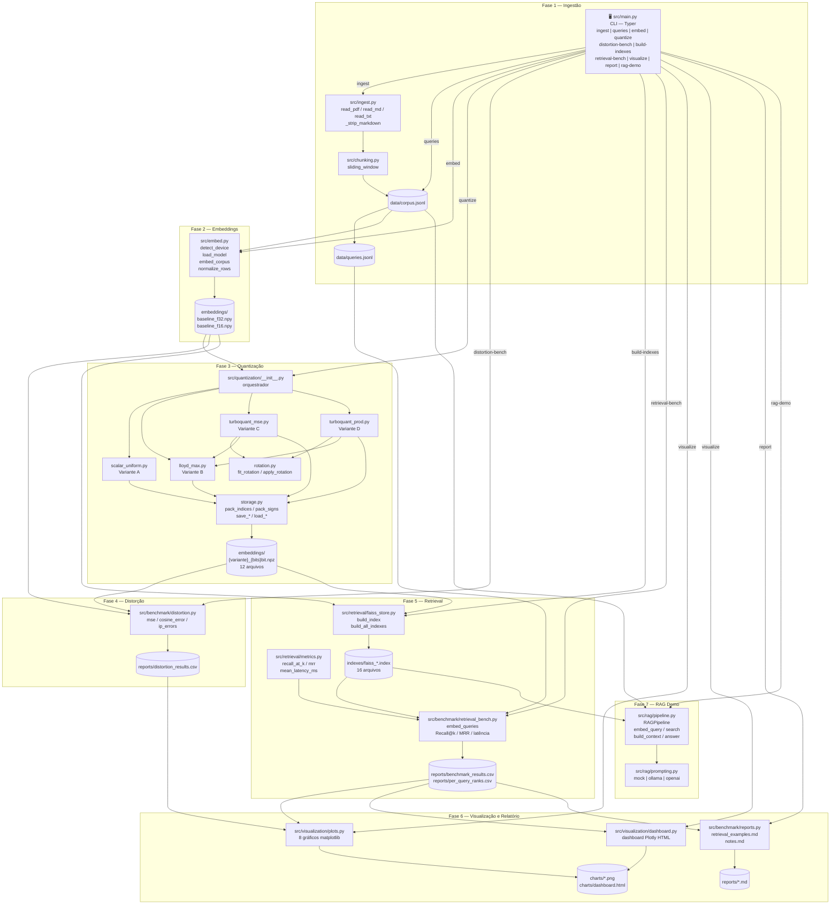
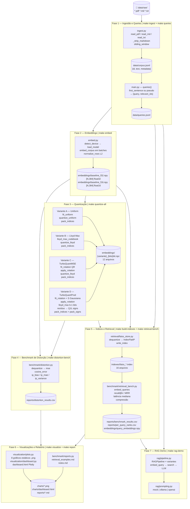
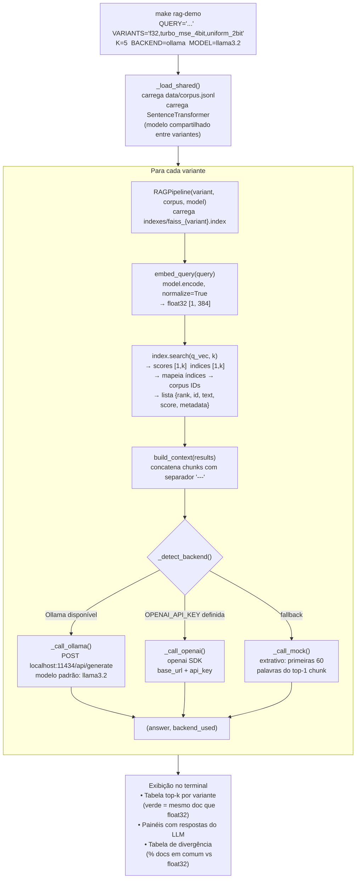
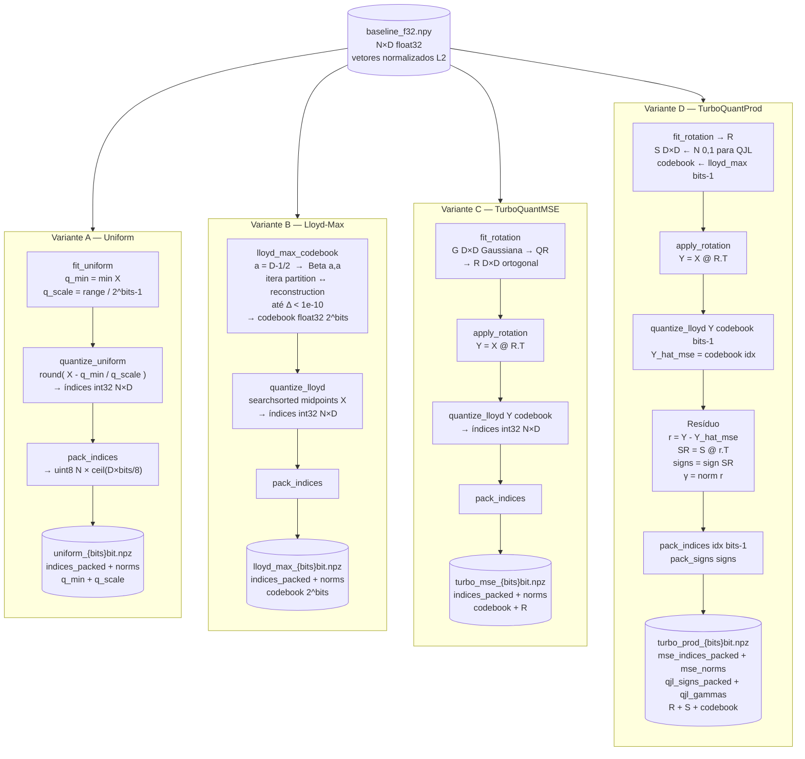
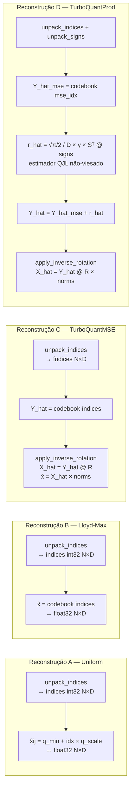

# RAG Embedding Compression Lab — Documentação Técnica

> Laboratório de pesquisa para medir o impacto de quantização de embeddings na qualidade de retrieval em sistemas RAG.

---

## Sumário

1. [Visão Geral](#1-visão-geral)
2. [Estrutura de Arquivos](#2-estrutura-de-arquivos)
3. [Configurações — o que cada campo significa](#3-configurações)
4. [Variáveis de Ambiente (.env)](#4-variáveis-de-ambiente)
5. [Descrição de Cada Módulo](#5-descrição-de-cada-módulo)
6. [Diagrama de Conexão entre Módulos](#6-diagrama-de-conexão-entre-módulos)
7. [Diagrama de Fluxo — Pipeline Completo](#7-diagrama-de-fluxo--pipeline-completo)
8. [Diagrama de Fluxo — RAG Demo (Fase 7)](#8-diagrama-de-fluxo--rag-demo-fase-7)
9. [Diagrama de Fluxo — Quantização](#9-diagrama-de-fluxo--quantização)
10. [Makefile — Comandos Disponíveis](#10-makefile--comandos-disponíveis)
11. [Dependências e pyproject.toml](#11-dependências-e-pyprojecttoml)

---

## 1. Visão Geral

O projeto implementa e compara **4 estratégias de quantização de embeddings** em 3 níveis de bits (2, 4, 8), medindo o impacto em:

- **Distorção geométrica** — MSE, erro de cosseno, viés de produto interno
- **Qualidade de retrieval** — Recall@1/5/10, MRR
- **Eficiência** — compressão de memória (até 16×), latência de busca

```
Documentos Raw ──► Chunks ──► Embeddings F32 ──► Quantização ──► FAISS Index
                                                        │
                             ┌──────────────────────────┴───────────────────────────┐
                             │  A) Uniform   B) Lloyd-Max   C) TurboMSE   D) TurboProd  │
                             └──────────────────────────────────────────────────────────┘
                                        │
                                  Benchmarks
                                  (Distorção + Retrieval)
                                        │
                                  Gráficos + RAG Demo
```

---

## 2. Estrutura de Arquivos

```
rag-embedding-compression-lab/
│
├── configs/                        # Configurações YAML do projeto
│   ├── benchmark.yaml              # Parâmetros dos benchmarks (bits, top-k, seeds, variantes)
│   ├── dataset.yaml                # Parâmetros de ingestão e chunking
│   └── embedding.yaml             # Modelo de embedding, device, batch size
│
├── data/
│   ├── raw/                        # Documentos de entrada (PDF, MD, TXT)
│   ├── processed/                  # Chunks intermediários por arquivo (*.jsonl)
│   ├── corpus.jsonl                # Corpus unificado com todos os chunks
│   └── queries.jsonl              # Pares query → relevant_ids para benchmarks
│
├── embeddings/
│   ├── baseline_f32.npy            # Embeddings originais float32 [N, D]
│   ├── baseline_f16.npy            # Embeddings float16 (2× compressão, referência)
│   ├── query_embeddings.npy        # Embeddings das queries (salvo após retrieval-bench)
│   ├── uniform_{2,4,8}bit.npz      # Quantização uniforme bit-packed
│   ├── lloyd_max_{2,4,8}bit.npz    # Quantização Lloyd-Max bit-packed
│   ├── turbo_mse_{2,4,8}bit.npz    # TurboQuantMSE bit-packed
│   └── turbo_prod_{2,4,8}bit.npz   # TurboQuantProd bit-packed (MSE + QJL)
│
├── indexes/
│   ├── faiss_f32.index             # Índice FAISS baseline float32
│   ├── faiss_f16.index             # Índice FAISS baseline float16
│   └── faiss_{variante}_{bits}bit.index  # Índice por variante (14 arquivos)
│
├── src/
│   ├── main.py                     # CLI principal (Typer) — orquestra todas as fases
│   ├── ingest.py                   # Fase 1A: leitura de PDF/MD/TXT → chunks
│   ├── chunking.py                 # Fase 1B: sliding window por palavras
│   ├── embed.py                    # Fase 2: geração de embeddings com SentenceTransformer
│   │
│   ├── quantization/
│   │   ├── __init__.py             # Pipeline de quantização (orquestra A, B, C, D)
│   │   ├── scalar_uniform.py       # Variante A: quantização uniforme min/max
│   │   ├── lloyd_max.py            # Variante B: codebook Lloyd-Max otimal
│   │   ├── turboquant_mse.py       # Variante C: rotação + Lloyd-Max
│   │   ├── turboquant_prod.py      # Variante D: rotação + Lloyd-Max + QJL
│   │   ├── rotation.py             # Geração de matriz ortogonal aleatória (QR)
│   │   ├── loader.py              # Centraliza load_and_dequantize para todas as variantes
│   │   └── storage.py             # Bit-packing, serialização e deserialização
│   │
│   ├── retrieval/
│   │   ├── faiss_store.py          # Construção e consulta de índices FAISS
│   │   └── metrics.py             # Recall@k, MRR, latência
│   │
│   ├── benchmark/
│   │   ├── distortion.py           # Fase 4: MSE, cosine error, IP bias/MAE/variance
│   │   ├── retrieval_bench.py      # Fase 5: Recall@k, MRR, latência, tamanho
│   │   └── reports.py             # Fase 6: relatório Markdown com análise qualitativa
│   │
│   ├── rag/
│   │   ├── pipeline.py             # Fase 7: RAGPipeline (embed → search → LLM)
│   │   └── prompting.py           # Template de prompt, backends LLM (mock/Ollama/OpenAI)
│   │
│   └── visualization/
│       ├── plots.py                # Fase 6: 8 gráficos estáticos (matplotlib)
│       ├── _dashboard_figs.py      # Fase 6: figuras Plotly do dashboard
│       ├── _dashboard_html.py      # Fase 6: template HTML e montagem do dashboard
│       └── dashboard.py           # Fase 6: orquestra → gera charts/dashboard.html
│
├── reports/
│   ├── benchmark_results.csv       # Recall@k, MRR, latência, compressão por variante
│   ├── distortion_results.csv      # MSE, cosine error, IP errors por variante
│   ├── per_query_ranks.csv         # Rank do relevante por query × variante
│   ├── retrieval_examples.md       # Análise qualitativa das queries
│   └── notes.md                   # Resumo dos resultados e próximos passos
│
├── charts/
│   ├── recall_vs_bits.png          # Recall@k por bits e variante
│   ├── mse_vs_bits.png             # MSE (log) por bits
│   ├── memory_compression.png      # Tamanho de memória por variante
│   ├── latency_comparison.png      # Latência de busca
│   ├── tradeoff_recall_memory.png  # ⭐ Scatter: Recall × Memória + Pareto
│   ├── ip_error_heatmap.png        # Heatmap de erros de produto interno
│   ├── recall_degradation_per_query.png  # Violin: rank por query
│   ├── compression_ratio_vs_recall_loss.png  # Dual-axis: compressão × perda
│   └── dashboard.html             # Dashboard interativo Plotly
│
├── .env                            # Variáveis de ambiente (não commitado)
├── .env.example                    # Modelo de .env
├── pyproject.toml                  # Definição do projeto Python (uv/hatch)
├── Makefile                        # Atalhos para todas as fases do pipeline
├── README.md                       # Introdução rápida
└── HOWTO.md                        # Guia de uso passo a passo
```

---

## 3. Configurações

### `configs/dataset.yaml`

| Campo             | Tipo  | Padrão         | Descrição                                                                      |
|-------------------|-------|----------------|--------------------------------------------------------------------------------|
| `corpus_path`     | str   | `data/corpus.jsonl`  | Caminho de saída do corpus unificado                                   |
| `queries_path`    | str   | `data/queries.jsonl` | Caminho de saída das queries                                           |
| `chunk_size`      | int   | `64`           | **Palavras por chunk.** 64 palavras ≈ 5–6 frases. Valor ideal para RAG de lab. Aumentar para corpora densos. |
| `chunk_overlap`   | int   | `16`           | **Palavras de sobreposição** entre chunks consecutivos. Garante que frases no limite de um chunk apareçam em dois chunks, preservando contexto. |
| `min_chunk_length`| int   | `20`           | **Mínimo de palavras** para um chunk ser incluído. Chunks menores (cabeçalhos, rodapés) são descartados. |

---

### `configs/embedding.yaml`

| Campo        | Tipo   | Padrão                    | Descrição                                                                                         |
|--------------|--------|---------------------------|---------------------------------------------------------------------------------------------------|
| `model`      | str    | `BAAI/bge-small-en-v1.5`  | **Modelo de embedding.** Baixado automaticamente do HuggingFace Hub na primeira execução. Produz vetores de dim=384. |
| `batch_size` | int    | `64`                      | **Chunks por batch** na geração de embeddings. Aumentar para GPU com mais VRAM. Reduzir se ocorrer OOM. |
| `normalize`  | bool   | `true`                    | **Normalização L2.** Os vetores são projetados na esfera unitária S^(d-1). Obrigatório para TurboQuant. |
| `device`     | str    | `cpu`                     | **Device de inferência.** Opções: `cpu`, `cuda`, `mps`. Detecção automática disponível via CLI. |
| `cache_dir`  | str\|null | `null`                 | **Diretório de cache** do HuggingFace. `null` usa `~/.cache/huggingface/hub/` (padrão). |

**Modelos alternativos:**
| Modelo                          | Dimensão | Tamanho  | Recomendação               |
|---------------------------------|----------|----------|----------------------------|
| `BAAI/bge-small-en-v1.5`        | 384      | ~130 MB  | ✅ Padrão (ótimo para CPU) |
| `BAAI/bge-base-en-v1.5`         | 768      | ~430 MB  | Alta qualidade, mais lento |
| `nomic-ai/nomic-embed-text-v1`  | 768      | ~550 MB  | Corpus grandes em inglês   |

---

### `configs/benchmark.yaml`

| Campo          | Tipo       | Padrão | Descrição                                                                                            |
|----------------|------------|--------|------------------------------------------------------------------------------------------------------|
| `bits_list`    | list[int]  | `[2, 4, 8]` | **Níveis de bits** avaliados em cada variante de quantização.                               |
| `top_k_list`   | list[int]  | `[1, 5, 10]` | **Profundidades de Recall** calculadas no benchmark de retrieval.                           |
| `random_seed`  | int        | `42`   | **Semente global** para reprodutibilidade: usada na matriz de rotação R e em amostras aleatórias. |
| `qjl_seed`     | int        | `123`  | **Semente da matriz Gaussiana S** do estimador QJL na TurboQuantProd. Separada do `random_seed` por design. |
| `num_queries`  | int        | `100`  | **Máximo de queries** usadas no benchmark de distorção e retrieval.                              |
| `variants`     | list[dict] | 14 variantes | Declaração explícita de todas as variantes avaliadas (tipo + bits). Usada como referência de configuração. |

---

## 4. Variáveis de Ambiente

Arquivo `.env` (copie de `.env.example`):

| Variável             | Padrão                      | Descrição                                                                                      |
|----------------------|-----------------------------|------------------------------------------------------------------------------------------------|
| `EMBEDDING_MODEL`    | `BAAI/bge-small-en-v1.5`    | Sobrescreve `embedding.yaml`. Útil para trocar modelo sem editar arquivos.                     |
| `EMBEDDING_BATCH_SIZE` | `64`                      | Sobrescreve `embedding.yaml`. Reduzir para máquinas com pouca RAM.                            |
| `EMBEDDING_DEVICE`   | `cpu`                       | Device de inferência. Sobrescreve `embedding.yaml`. Valores: `cpu`, `cuda`, `mps`.           |
| `RANDOM_SEED`        | `42`                        | Semente para matriz de rotação R e seleção aleatória de queries. Afeta reprodutibilidade.     |
| `QJL_SEED`           | `123`                       | Semente da matriz Gaussiana S na TurboQuantProd. Deve ser diferente de `RANDOM_SEED`.         |
| `CORPUS_PATH`        | `data/corpus.jsonl`         | Caminho do corpus. Útil para testar com corpora diferentes sem alterar configs.               |
| `QUERIES_PATH`       | `data/queries.jsonl`        | Caminho das queries. Alterável para comparar estratégias de query.                            |
| `LLM_BACKEND`        | _(auto-detect)_             | Backend LLM para o RAG Demo: `mock`, `ollama`, `openai`. Auto-detect tenta Ollama primeiro.  |
| `LLM_MODEL`          | _(depende do backend)_      | Modelo LLM. Ex: `llama3.2` (Ollama), `gpt-4o-mini` (OpenAI).                                 |
| `OPENAI_BASE_URL`    | `https://api.openai.com/v1` | URL da API compatível com OpenAI. Permite usar LLMs locais com interface OpenAI.             |
| `OPENAI_API_KEY`     | _(não definida)_            | Chave de API OpenAI ou serviço compatível.                                                    |

---

## 5. Descrição de Cada Módulo

### `src/main.py` — CLI Principal
**O que é:** Ponto de entrada do CLI. Usa a biblioteca `Typer` para expor todos os comandos do pipeline como subcomandos do executável `lab` (ou `uv run python -m src.main`).

**Funções:**
| Comando CLI       | Função Python            | Fase | Descrição                                                   |
|-------------------|--------------------------|------|-------------------------------------------------------------|
| `ingest`          | `ingest()`               | 1    | Processa `data/raw/` → `corpus.jsonl`                       |
| `queries`         | `queries()`              | 1    | Gera `queries.jsonl` por `first_sentence` ou `pseudo`       |
| `embed`           | `embed()`                | 2    | Gera `baseline_f32.npy` e `baseline_f16.npy`                |
| `quantize`        | `quantize()`             | 3    | Quantiza uma variante específica em N bits                  |
| `distortion-bench`| `distortion_bench()`     | 4    | MSE, cosine error, IP errors por variante                   |
| `build-indexes`   | `build_indexes()`        | 5    | Constrói índices FAISS para todas as variantes              |
| `retrieval-bench` | `retrieval_bench()`      | 5    | Recall@k, MRR, latência, tamanho por variante               |
| `visualize`       | `visualize()`            | 6    | Gera 8 gráficos estáticos + dashboard.html                  |
| `report`          | `report()`               | 6    | Gera `retrieval_examples.md` e `notes.md`                   |
| `rag-demo`        | `rag_demo()`             | 7    | Demo RAG interativo comparando variantes                    |

**Funções auxiliares:**
- `_queries_first_sentence()` — extrai primeira frase de cada chunk como query
- `_queries_pseudo()` — usa embeddings F32 + FAISS para criar ground truth

---

### `src/ingest.py` — Ingestão de Documentos
**O que é:** Carrega arquivos de `data/raw/`, limpa o conteúdo e aplica chunking. Suporta 3 formatos.

**Funções:**
| Função              | Descrição                                                                                    |
|---------------------|----------------------------------------------------------------------------------------------|
| `read_pdf(path)`    | Extrai texto página a página usando `pymupdf` (fitz). Retorna lista de dicts com `text`, `page`, `source`. |
| `read_txt(path)`    | Lê arquivo `.txt` inteiro como bloco único.                                                  |
| `read_md(path)`     | Lê arquivo `.md` e remove marcações Markdown (headers, bold, links, code blocks, tabelas). |
| `_strip_markdown()` | Remove sintaxe Markdown preservando o conteúdo textual. Headers `##` → texto puro, bold `**` → texto, etc. |
| `_make_id()`        | Gera ID no formato `<stem>-p<page>-c<chunk_idx>` com 4 dígitos no índice (ex: `rag-systems-p00-c0003`). |
| `ingest()`          | **Pipeline principal**: varre diretório, lê arquivos, aplica chunking, salva `corpus.jsonl` e `processed/*.jsonl`. |
| `_process_single_file()` | Leitura e chunking de um único arquivo. Retorna lista de dicts ou `None` em caso de erro. |
| `_write_jsonl()`    | Escreve lista de dicts em formato JSONL. |
| `load_corpus()`     | Utilitário: carrega `corpus.jsonl` e retorna lista de dicts. |
| `queries_first_sentence()` | Para cada chunk, extrai a primeira frase como query. Filtra duplicadas e muito curtas. |
| `_extract_first_sentence()` | Extrai e limpa a primeira frase de um texto. |
| `queries_pseudo()`  | Pseudo ground truth via embedding f32 + FAISS top-k. Fallback para `first_sentence` se embeddings não existirem. |

**Formato de cada chunk no corpus.jsonl:**
```json
{
  "id": "rag-systems-overview-p00-c0003",
  "text": "texto do chunk aqui...",
  "metadata": {
    "source": "rag-systems-overview.md",
    "page": null,
    "chunk_idx": 3,
    "type": "md"
  }
}
```

---

### `src/chunking.py` — Divisão em Chunks
**O que é:** Implementa a estratégia de divisão por **sliding window de palavras**.

**Funções:**
| Função                    | Descrição                                                                                       |
|---------------------------|-------------------------------------------------------------------------------------------------|
| `_clean_text(text)`       | Normaliza quebras de linha, remove espaços múltiplos, preserva estrutura de parágrafos.        |
| `sliding_window(text, chunk_size, overlap, min_chunk_length)` | Divide texto em janelas deslizantes. O `step = chunk_size - overlap`. Descarta janelas menores que `min_chunk_length`. |

**Por que palavras e não tokens?**
PDF extraído tem espaçamento irregular. Tokenizar com `transformers` seria mais lento sem ganho prático para tamanhos nessa faixa (256 palavras ≈ 340 tokens).

---

### `src/embed.py` — Geração de Embeddings
**O que é:** Fase 2 do pipeline. Usa `SentenceTransformer` para gerar vetores de cada chunk e os projeta na esfera unitária.

**Funções:**
| Função                             | Descrição                                                                                          |
|------------------------------------|----------------------------------------------------------------------------------------------------|
| `detect_device(preferred)`         | Detecta o melhor device disponível (CUDA → MPS → CPU). Trata corretamente AMD RX 580 (gfx803) sem suporte ROCm. |
| `load_model(model_name, device)`   | Carrega `SentenceTransformer`. Primeira execução faz download do HuggingFace Hub (~130 MB).      |
| `embed_corpus(corpus_path, model)` | Lê `corpus.jsonl`, gera embeddings em batches com barra de progresso. Retorna `float32 [N, D]`.  |
| `normalize_rows(X)`                | Normalização L2: divide cada vetor por sua norma. Vetores nulos são preservados (evita divisão por zero). |
| `save_embeddings(X, path, dtype)`  | Salva array `.npy`. Suporta conversão de dtype (float32→float16).                               |
| `load_embeddings(path)`            | Carrega `.npy` com verificação de existência.                                                     |
| `embed_pipeline(device)`           | **Pipeline completo**: detecta device → carrega modelo → embeda corpus → normaliza → salva f32 + f16. |

---

### `src/quantization/scalar_uniform.py` — Variante A: Quantização Uniforme
**O que é:** A quantização mais simples. Divide o intervalo `[q_min, q_max]` em `2^bits - 1` bins iguais.

**Por que serve de baseline:** Não usa nenhuma técnica especial. Qualquer método melhor precisa superar esse baseline.

| Função                          | Descrição                                                                      |
|---------------------------------|--------------------------------------------------------------------------------|
| `fit_uniform(X, bits)`          | Calcula `q_min` e `q_scale` globais sobre todos os valores de X.              |
| `quantize_uniform(X, state)`    | Arredonda cada coordenada para o bin mais próximo. Retorna índices `int32`.   |
| `dequantize_uniform(idx, state)`| Reconstrói floats: `q_min + index * q_scale`.                                 |

**`UniformState`:** dataclass com `q_min`, `q_scale`, `bits`, `dim`.

---

### `src/quantization/lloyd_max.py` — Variante B: Codebook Lloyd-Max
**O que é:** Codebook **ótimo para a distribuição de coordenada na esfera unitária**. Minimiza o MSE esperado para vetores normalizados.

**Matemática:** Para x ∈ S^(d-1), cada coordenada segue Beta(a, a) com `a = (d-1)/2`. O codebook é independente dos dados — depende só de `(dim, bits)`.

| Função                          | Descrição                                                                                                      |
|---------------------------------|----------------------------------------------------------------------------------------------------------------|
| `_beta_alpha(dim)`              | Calcula parâmetro `a` da distribuição Beta equivalente à esfera.                                              |
| `coord_pdf(xs, dim)`            | PDF de uma coordenada de vetor uniforme em S^(d-1). Usa scipy.stats.beta para estabilidade numérica.         |
| `lloyd_max_codebook(dim, bits)` | **Algoritmo Lloyd-Max**: itera entre partition (midpoints) e reconstruction (E[X\|bucket]) até convergência. |
| `get_codebook(dim, bits)`       | Cache global: computa e cacheia o codebook para cada (dim, bits). Evita recomputação.                        |
| `quantize_lloyd(X, codebook)`   | `searchsorted` nos midpoints → índice do centróide mais próximo. O(N·D·log K) sem alocar tensor [N,D,K].   |
| `dequantize_lloyd(idx, codebook)`| Lookup direto: `codebook[indices]`.                                                                          |

---

### `src/quantization/rotation.py` — Matriz de Rotação Ortogonal
**O que é:** Gera e aplica a rotação ortogonal aleatória que uniformiza a energia entre dimensões antes da quantização.

| Função                          | Descrição                                                                                     |
|---------------------------------|-----------------------------------------------------------------------------------------------|
| `fit_rotation(dim, seed)`       | QR de matriz Gaussiana aleatória → Q ortogonal. Distribuição uniforme sobre o grupo ortogonal (medida de Haar). |
| `apply_rotation(X, R)`          | `Y = X @ R.T` — rotaciona cada vetor linha.                                                  |
| `apply_inverse_rotation(Y, R)`  | `X = Y @ R` — rotação inversa (ortogonal → inversa = transposta).                            |

**Por que rotar?** Sem rotação, as coordenadas de um embedding têm **variância não-uniforme** — algumas dimensões carregam muito mais informação. O codebook Lloyd-Max assume distribuição esférica uniforme, que só é válida após rotação.

---

### `src/quantization/turboquant_mse.py` — Variante C: TurboQuantMSE
**O que é:** Combina rotação ortogonal + codebook Lloyd-Max. Minimiza o MSE de reconstrução.

| Função                              | Descrição                                                              |
|-------------------------------------|------------------------------------------------------------------------|
| `fit_turbo_mse(dim, bits, seed)`    | Gera R (rotação) + codebook Lloyd-Max. Sem dados necessários.         |
| `quantize_mse_batch(X, state)`      | `Y = X @ R.T` → `quantize_lloyd(Y, codebook)` → índices.             |
| `dequantize_mse_batch(idx, norms, state)` | lookup no codebook → `Y_hat` → `X_hat = Y_hat @ R` → reescala por normas. |

**`TurboMSEState`:** `R` [D,D], `codebook` [K], `dim`, `bits`, `seed`.

---

### `src/quantization/turboquant_prod.py` — Variante D: TurboQuantProd
**O que é:** TurboQuantMSE(b-1 bits) + **QJL (Johnson-Lindenstrauss Quantized)** no resíduo. Corrige o viés de produto interno introduzido pela quantização.

**Algoritmo:**
1. Rotaciona: `y = R @ x`
2. TurboMSE com `b-1` bits: `y_hat`, resíduo `r = y - y_hat`
3. QJL no resíduo: `signs = sign(S @ r)`, `γ = ||r||`
4. Reconstrução: `r_hat = √(π/2)/D · γ · Sᵀ @ signs`
5. Combina: `x_hat = Rᵀ @ (y_hat + r_hat)`

**Prova de não-viés:** `E[⟨q, r_hat⟩] = ⟨q, r⟩` para qualquer query q.

| Função                                    | Descrição                                                                            |
|-------------------------------------------|--------------------------------------------------------------------------------------|
| `fit_turbo_prod(dim, bits, seed, qjl_seed)` | Gera R (rotação) + S (Gaussiana para QJL) + codebook MSE(b-1 bits).             |
| `quantize_prod_batch(X, state)`           | Rotaciona → MSE b-1 bits → resíduo → QJL signs+gammas.                              |
| `dequantize_prod_batch(...)`              | Reconstrói MSE part + QJL correction → rotação inversa.                              |

---

### `src/quantization/storage.py` — Bit-packing e Serialização
**O que é:** Empacota índices de N bits em bytes, reduzindo o tamanho em disco de acordo com a taxa teórica.

**Por que é necessário:**
```
Sem packing: índice 2-bit armazenado como int32 → 4 bytes por dimensão = mesma memória que float32!
Com packing: 4 índices 2-bit por byte → dim=384 → 96 bytes/vetor = 16× compressão real
```

| Função                     | Descrição                                                                          |
|----------------------------|------------------------------------------------------------------------------------|
| `pack_indices(idx, bits)`  | Expande cada índice em `bits` bits, empacota 8 por byte. Retorna `uint8 [N, ceil(D*bits/8)]`. |
| `unpack_indices(packed, bits, D)` | Desempacota bytes em índices inteiros `int32 [N, D]`.                        |
| `pack_signs(signs)`        | Empacota sinais {+1,-1} como bits individuais: 1 bit por dimensão.                |
| `unpack_signs(packed, D)`  | Desempacota para float32 {+1.0, -1.0}.                                            |
| `save_uniform/load_uniform` | Salva/carrega formato `.npz` para quantização uniforme.                          |
| `save_lloyd/load_lloyd`    | Salva/carrega formato `.npz` para Lloyd-Max (inclui codebook).                    |
| `save_turbo_mse/load_turbo_mse` | Salva/carrega formato `.npz` para TurboQuantMSE (inclui R, codebook).       |
| `save_turbo_prod/load_turbo_prod` | Salva/carrega formato `.npz` para TurboQuantProd (inclui R, S, signs, gammas). |

**Taxas de compressão reais (dim=384, sem overhead de R e S):**
| Variante  | 2-bit  | 4-bit   | 8-bit   |
|-----------|--------|---------|---------|
| uniform   | 98 B   | 194 B   | 386 B   |
| lloyd_max | 98 B   | 194 B   | 386 B   |
| turbo_mse | 98 B   | 194 B   | 386 B   |
| turbo_prod| 98 B   | 194 B   | 386 B   |
| float32   | 1536 B | 1536 B  | 1536 B  |
| **Razão** | **~15.7×** | **~7.9×** | **~4.0×** |

---

### `src/retrieval/faiss_store.py` — Índices FAISS
**O que é:** Constrói e gerencia índices `IndexFlatIP` do FAISS para busca exata por produto interno (equivalente a cosseno para vetores normalizados).

| Função                              | Descrição                                                                       |
|-------------------------------------|---------------------------------------------------------------------------------|
| `build_index(embeddings)`           | Cria `IndexFlatIP` e adiciona vetores float32.                                  |
| `save_index(index, path)`           | Serializa índice FAISS em disco.                                               |
| `load_index(path)`                  | Carrega índice FAISS do disco.                                                 |
| `_load_variant_embeddings(variant, bits)` | Carrega e dequantiza uma variante específica para float32.              |
| `build_all_indexes()`               | **Constrói todos os 16 índices** (2 baselines + 4 variantes × 3 bits).        |

**Nota:** Todos os índices armazenam float32 em RAM. A economia de memória é no armazenamento em disco (`.npz` bit-packed).

---

### `src/retrieval/metrics.py` — Métricas de Retrieval
**O que é:** Funções puras de avaliação de retrieval.

| Função                         | Descrição                                                                                  |
|--------------------------------|--------------------------------------------------------------------------------------------|
| `recall_at_k(retrieved, relevant, k)` | Fração de queries com ≥1 relevante no top-k. Métrica principal do benchmark.   |
| `mrr(retrieved, relevant)`     | Mean Reciprocal Rank: média de 1/rank do primeiro relevante. Penaliza mais posições altas. |
| `mean_latency_ms(search_fn, query_vecs, k, n_runs)` | Latência mediana por query em ms. Usa mediana para robustez contra JIT/cache. |

---

### `src/benchmark/distortion.py` — Benchmark de Distorção (Fase 4)
**O que é:** Mede o quanto cada variante deforma os vetores geometricamente, ANTES de testar retrieval.

| Função                             | Descrição                                                                                   |
|------------------------------------|---------------------------------------------------------------------------------------------|
| `mse(X_orig, X_hat)`               | MSE médio: `mean(||x - x̂||²)`. Mede erro geométrico absoluto.                             |
| `cosine_error(X_orig, X_hat)`      | `1 - cosine_similarity_médio`. Mede quanto a *direção* do vetor mudou.                     |
| `ip_errors(X_orig, X_hat, Q)`      | Para cada par (query_i, doc_j), calcula `(Q_i·X̂_j) - (Q_i·X_j)`. Retorna bias, MAE e variance. |
| `build_query_matrix(...)`          | Extrai vetores de query do corpus via `queries.jsonl → relevant_ids → índice → baseline_f32`. |
| `compute_distortion_table(...)`    | Calcula todas as métricas para todas as variantes. Retorna DataFrame.                       |
| `run_distortion_bench()`           | **Entry point**: carrega dados → calcula métricas → salva CSV → gera 2 gráficos.           |

---

### `src/quantization/loader.py` — Dequantização Centralizada
**O que é:** Módulo criado para eliminar duplicação entre `benchmark/distortion.py` e `retrieval/faiss_store.py`.

| Função | Descrição |
|---|---|
| `load_and_dequantize(variant, bits)` | Carrega `.npz`, dequantiza e retorna `[N, D] float32`. Retorna `None` se o arquivo não existir. |

---

### `src/benchmark/retrieval_bench.py` — Benchmark de Retrieval (Fase 5)
**O que é:** Avaliação completa: embeda queries → busca em todos os índices → calcula métricas.

| Função                       | Descrição                                                                              |
|------------------------------|----------------------------------------------------------------------------------------|
| `embed_queries(query_texts)` | Embeda textos das queries com o mesmo modelo do corpus, com normalização.              |
| `_embed_size_mb(variant, bits, N, D)` | Calcula tamanho teórico dos dados de embedding por variante (sem R/S). Métrica de produção. |
| `_search_index(index, Q, k, corpus_ids)` | Busca top-k e mapeia índices FAISS → IDs do corpus.                         |
| `_load_retrieval_inputs()` | Carrega corpus, queries e embeda queries. Retorna `(corpus, raw, ids, Q, N, D)`.         |
| `_build_variant_tasks()` | Monta lista `(variant, bits, index_path)`. Constrói índices se ausentes.                  |
| `_eval_all_variants(...)` | Avalia cada variante: busca, métricas de qualidade e latência.                           |
| `_sort_results(df)` | Ordena DataFrame por grupo de variante e bits decrescente.                                |
| `_save_retrieval_results(...)` | Persiste CSVs e embeddings das queries em disco.                                     |
| `run_retrieval_bench(topk)`  | **Entry point**: orquestra todos os helpers → salva CSVs → gera gráficos.             |

**Saídas:**
- `reports/benchmark_results.csv` — Recall@1/5/10, MRR, latência, tamanho, compressão
- `reports/per_query_ranks.csv` — rank do relevante por query × variante
- `embeddings/query_embeddings.npy` — embeddings das queries para reutilização

---

### `src/benchmark/reports.py` — Relatório Qualitativo (Fase 6)
**O que é:** Analisa os CSVs de benchmark e gera relatório Markdown com exemplos concretos.

| Função             | Descrição                                                                                      |
|--------------------|------------------------------------------------------------------------------------------------|
| `generate_report()`| Lê `per_query_ranks.csv` → identifica queries que quebraram e que mantiveram qualidade → gera `retrieval_examples.md` e `notes.md`. |
| `_write_notes()`   | Escreve `notes.md` com sweet spot, configuração e próximos passos.                            |

---

### `src/rag/pipeline.py` — Pipeline RAG (Fase 7)
**O que é:** Pipeline RAG completo para demo interativo. Compara múltiplas variantes lado a lado.

| Classe/Função                 | Descrição                                                                              |
|-------------------------------|----------------------------------------------------------------------------------------|
| `RAGPipeline`                 | Pipeline single-variant. Carrega índice FAISS, embeda query, busca, gera resposta.   |
| `RAGPipeline.embed_query()`   | Embeda a query com o mesmo modelo/normalização do corpus.                              |
| `RAGPipeline.search(query, k)`| Busca top-k no índice FAISS. Retorna lista de dicts com id, text, score, metadata, rank. |
| `RAGPipeline.build_context()` | Concatena chunks recuperados com separador para o contexto do LLM.                    |
| `RAGPipeline.answer()`        | **Pipeline completo**: search → context → LLM → dict com todos os detalhes.          |
| `_load_shared()`              | Carrega corpus e modelo uma única vez (compartilhado entre variantes).                |
| `run_demo(query, variants, k)`| **Entry point CLI**: instancia um `RAGPipeline` por variante → executa → exibe comparação. |
| `_print_results_table()`      | Tabela comparativa dos docs recuperados (verde = igual ao f32, amarelo = diferente).  |
| `_print_divergence()`         | Tabela mostrando % de documentos em comum entre cada variante e o float32.           |

---

### `src/rag/prompting.py` — Template de Prompt e LLM
**O que é:** Gerencia o prompt e chama o LLM no backend disponível.

| Função/Backend          | Descrição                                                                                     |
|-------------------------|-----------------------------------------------------------------------------------------------|
| `PROMPT_TEMPLATE`       | Prompt em português. Instrui o modelo a usar APENAS o contexto fornecido.                    |
| `format_prompt()`       | Preenche o template com query e contexto.                                                     |
| `_detect_backend()`     | Auto-detecta backend: testa Ollama → verifica `OPENAI_API_KEY` → fallback para mock.         |
| `_call_mock()`          | **Mock extrativo**: retorna as primeiras 60 palavras do top-1 chunk. Sem dependências externas. |
| `_call_ollama()`        | Chama `POST http://localhost:11434/api/generate`. Modelo padrão: `llama3.2`.                 |
| `_call_openai()`        | Usa `openai` SDK com `base_url` e `api_key` configuráveis. Suporta APIs compatíveis com OpenAI. |
| `call_llm()`            | **Entry point**: seleciona backend → formata prompt → chama → retorna `(answer, backend_used)`. |

---

### `src/visualization/plots.py` — Gráficos Estáticos (Fase 6)
**O que é:** Gera os 8 gráficos estáticos do lab usando matplotlib.

| Função                             | Arquivo de saída                        | Tipo          | Insight principal                               |
|------------------------------------|-----------------------------------------|---------------|-------------------------------------------------|
| `plot_recall_vs_bits()`            | `recall_vs_bits.png`                    | Line chart    | Recall@k degrada com menos bits por variante    |
| `plot_mse_vs_bits()`               | `mse_vs_bits.png`                       | Bar agrupado  | turbo_mse tem MSE muito menor que uniform       |
| `plot_memory_compression()`        | `memory_compression.png`                | Bar horizontal| Tamanho real com bit-packing correto            |
| `plot_latency()`                   | `latency_comparison.png`                | Bar chart     | Latência idêntica — FAISS sempre usa float32    |
| `plot_tradeoff()` ⭐               | `tradeoff_recall_memory.png`            | Scatter+Pareto| Sweet spot: turbo_mse 4-bit                     |
| `plot_ip_heatmap()`                | `ip_error_heatmap.png`                  | Heatmap       | QJL (TurboProd) corrige viés de IP              |
| `plot_recall_degradation()`        | `recall_degradation_per_query.png`      | Violin+strip  | Quais queries sofrem mais degradação            |
| `plot_compression_vs_recall_loss()`| `compression_ratio_vs_recall_loss.png`  | Dual-axis     | Compressão × perda de recall                    |

---

## 6. Diagrama de Conexão entre Módulos



---

## 7. Diagrama de Fluxo — Pipeline Completo



---

## 8. Diagrama de Fluxo — RAG Demo (Fase 7)



---

## 9. Diagrama de Fluxo — Quantização

### 9.1 Visão geral das 4 variantes



### 9.2 Reconstrução (dequantização)



---

## 10. Makefile — Comandos Disponíveis

```
make setup           # Instala dependências (uv sync) e cria .env
make env             # Só instala dependências

# ── Fase 1: Dados ──────────────────────────
make ingest          # data/raw/ → corpus.jsonl
make queries         # corpus.jsonl → queries.jsonl (first_sentence)
make queries-pseudo  # corpus.jsonl + embeddings → queries.jsonl (pseudo ground truth)
make ingest-check    # Mostra contagem de chunks por arquivo

# ── Fase 2: Embeddings ─────────────────────
make embed           # → baseline_f32.npy + baseline_f16.npy
make embed-info      # Mostra device disponível

# ── Fase 3: Quantização ────────────────────
make quantize-uniform   # uniform 2/4/8-bit
make quantize-lloyd     # lloyd_max 2/4/8-bit
make quantize-mse       # turbo_mse 2/4/8-bit
make quantize-prod      # turbo_prod 2/4/8-bit
make quantize-all       # todas as variantes

# ── Fase 4: Distorção ──────────────────────
make distortion-bench   # MSE, cosine error, IP errors → distortion_results.csv

# ── Fase 5: Retrieval ──────────────────────
make build-indexes      # FAISS indexes para todas as variantes
make retrieval-bench    # Recall@k, MRR, latência → benchmark_results.csv

# ── Fase 6: Visualizações ──────────────────
make visualize          # 8 gráficos .png + dashboard.html
make report             # retrieval_examples.md + notes.md

# ── Fase 7: RAG Demo ───────────────────────
make rag-demo QUERY="sua pergunta aqui"
# Opcionais:
make rag-demo QUERY="..." VARIANTS="f32,turbo_mse_4bit" K=5 BACKEND=ollama MODEL=llama3.2

# ── Pipelines completos ────────────────────
make all-bench       # distortion-bench + build-indexes + retrieval-bench
make all             # ingest → queries → embed → quantize-all → all-bench → visualize → report

# ── Utilidades ─────────────────────────────
make clean           # Remove embeddings, indexes, reports, charts (mantém data/raw)
make help            # Lista todos os targets com descrição
```

---

## 11. Dependências e pyproject.toml

| Pacote                | Versão mínima | Uso no projeto                                                          |
|-----------------------|---------------|-------------------------------------------------------------------------|
| `numpy`               | 1.26          | Operações matriciais, embeddings, bit-packing                           |
| `pandas`              | 2.0           | DataFrames de resultados, CSVs de benchmark                            |
| `scipy`               | 1.11          | `scipy.stats.beta` para PDF da distribuição esférica (Lloyd-Max)       |
| `faiss-cpu`           | 1.7           | Índices `IndexFlatIP` para busca por produto interno exata              |
| `sentence-transformers`| 2.7          | Modelo de embedding `BAAI/bge-small-en-v1.5` local                     |
| `scikit-learn`        | 1.4           | Utilitários de ML (reserva para extensões futuras)                     |
| `typer[all]`          | 0.12          | CLI declarativo com auto-help e autocompletion                         |
| `rich`                | 13            | Tabelas, progress bars e output colorido no terminal                   |
| `pyyaml`              | 6             | Leitura dos arquivos de configuração YAML                              |
| `matplotlib`          | 3.8           | 8 gráficos estáticos em `charts/`                                      |
| `seaborn`             | 0.13          | Paleta de cores e ajustes de estilo                                     |
| `plotly`              | 5.20          | Dashboard interativo HTML                                               |
| `kaleido`             | 0.2           | Export estático de gráficos Plotly (PNG/SVG)                           |
| `tqdm`                | 4.66          | Progress bars em loops de encoding                                     |
| `python-dotenv`       | 1.0           | Carrega variáveis de ambiente do arquivo `.env`                        |
| `pymupdf`             | 1.24          | Extração de texto de PDFs via `fitz`                                   |

**Dev dependencies:**
| Pacote      | Uso                                    |
|-------------|----------------------------------------|
| `ipykernel` | Kernel Jupyter para notebooks          |
| `jupyter`   | Ambiente Jupyter Lab para exploração   |

**Entry point:**
```
lab = "src.main:app"
# Equivalente a: uv run python -m src.main
```

---

*Documentação gerada em 2026-04-11 — RAG Embedding Compression Lab v0.1.0*
