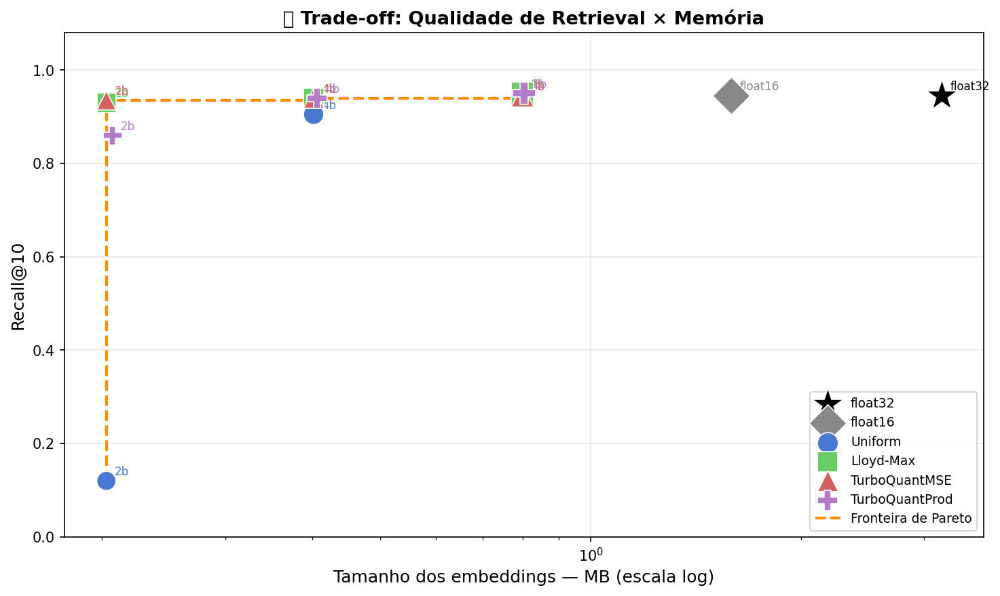
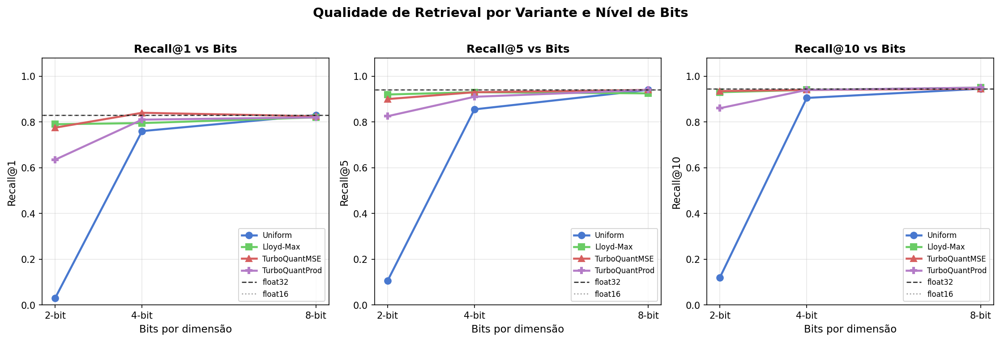
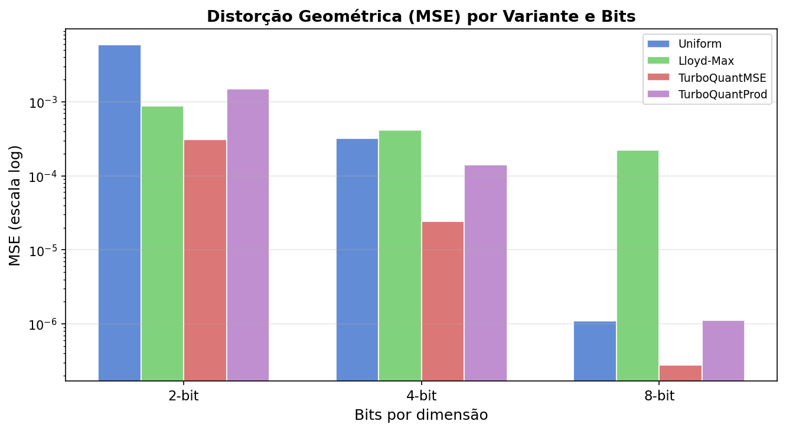
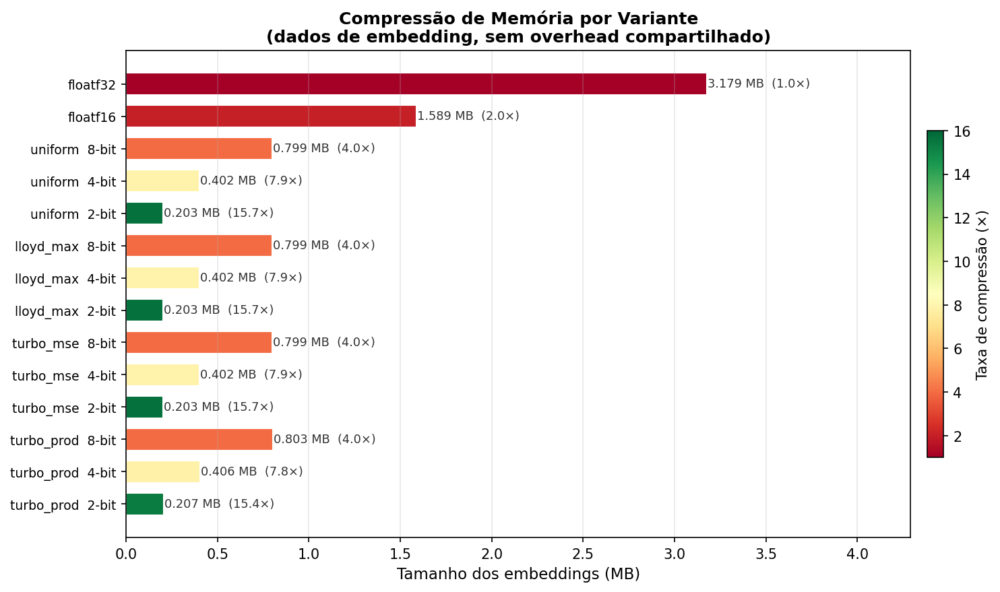
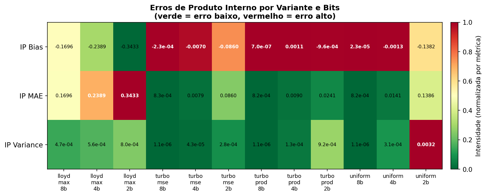
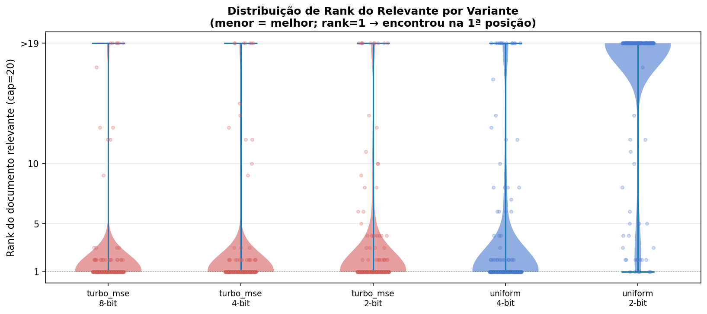
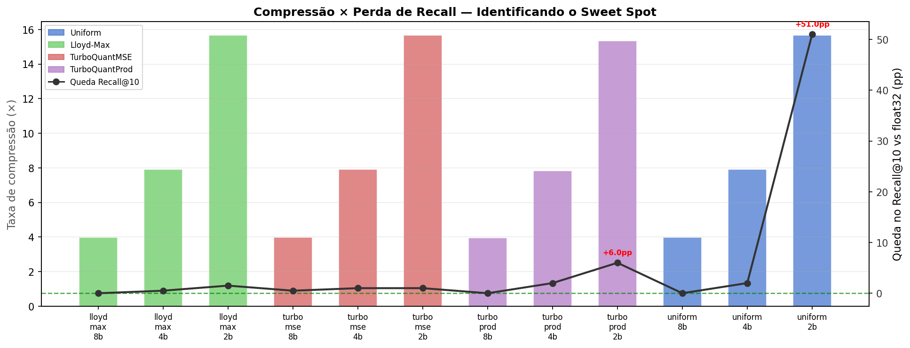

# Comprimindo Embeddings RAG em até 16× sem Perder Qualidade de Retrieval

> **Pergunta central:** quanto de memória dá para economizar nos embeddings de um sistema RAG
> antes de a busca começar a errar?

<p align="center">
  
  <br/>
  <em>Cada ponto é uma configuração (variante + bits). Eixo X em escala log. A linha laranja é a fronteira de Pareto.</em>
</p>

**Resposta curta:** com a técnica certa, **7.9× de compressão com zero perda de qualidade**. Com a técnica errada, 16× de compressão destrói o sistema.

---

## Índice

1. [O problema](#o-problema)
2. [Os quatro métodos](#os-quatro-métodos)
3. [O algoritmo TurboQuant em detalhe](#o-algoritmo-turboquant-em-detalhe)
4. [Resultados de retrieval](#resultados-de-retrieval)
5. [Por que a rotação muda tudo](#por-que-a-rotação-muda-tudo)
6. [Erros de produto interno e o QJL](#erros-de-produto-interno-e-o-qjl)
7. [Quais queries sofrem mais](#quais-queries-sofrem-mais)
8. [Impacto end-to-end no pipeline RAG](#impacto-end-to-end-no-pipeline-rag)
9. [Como rodar](#como-rodar)
10. [Referências](#referências)

---

## O problema

Sistemas RAG (_Retrieval-Augmented Generation_) funcionam em três etapas: **embeda** os documentos, **busca** os mais relevantes para cada query, **gera** a resposta com esse contexto. A etapa de busca depende de manter os embeddings em RAM — e eles crescem rápido:

```
1 documento × dim=384 × float32 = 1.536 KB por documento
1 milhão de documentos           = 1.5 GB só de embeddings
10 milhões de documentos         = 15 GB  (não cabe em 1 GPU)
```

A solução óbvia é quantizar — trocar float32 (4 bytes) por representações menores.
Mas **quantização ingênua destrói a busca**. Este lab mede exatamente onde está o limite.

---

## Os quatro métodos

O lab implementa quatro variantes em ordem crescente de sofisticação,
cada uma adicionando um componente sobre a anterior:

```
① uniform  ──(+ codebook ótimo)──▶  ② lloyd_max
                                            │
                                  (+ rotação ortogonal)
                                            │
                                            ▼
③ turbo_mse  ◀───────────────────────────────
      │
  (+ QJL no resíduo)
      │
      ▼
④ turbo_prod
```

| Variante | Rotação | Codebook | QJL | Bytes/vetor (dim=384) | Compressão |
|---|:---:|:---:|:---:|---:|---:|
| `baseline_f32` | — | — | — | 1.536 B | 1× |
| `baseline_f16` | — | — | — | 768 B | 2× |
| `uniform` | ✗ | bins iguais | ✗ | 98–386 B | 4–16× |
| `lloyd_max` | ✗ | Lloyd-Max | ✗ | 98–386 B | 4–16× |
| `turbo_mse` | **✓** | Lloyd-Max | ✗ | 98–386 B | 4–16× |
| `turbo_prod` | **✓** | Lloyd-Max | **✓** | 100–388 B | 4–16× |

### Como cada método funciona

**`uniform`** — divide o intervalo `[min, max]` de todos os valores em bins iguais e armazena o índice inteiro de cada bin. Simples, rápido, e frequentemente catastrófico a 2-bit.

**`lloyd_max`** — em vez de bins iguais, usa o algoritmo Lloyd-Max para encontrar os `2^b` centróides que minimizam o MSE para a distribuição teórica de uma coordenada de vetor unitário em S^(d−1). Essa distribuição é uma Beta(191.5, 191.5) — extremamente concentrada em torno de zero para dim=384.

**`turbo_mse`** _(TurboQuantMSE, baseado no paper TurboQuant)_ — aplica uma **rotação ortogonal aleatória** ao vetor antes de quantizar. A rotação redistribui a energia uniformemente entre todas as dimensões, fazendo com que cada coordenada siga exatamente a distribuição teórica para a qual o codebook Lloyd-Max foi projetado. O resultado: 33× menos MSE que o lloyd_max puro no mesmo nível de bits.

**`turbo_prod`** _(TurboQuantProd)_ — estende o MSE adicionando um segundo passo: quantiza o **resíduo** (vetor original − reconstrução MSE) com 1 bit por dimensão usando o estimador JL quantizado (QJL). Isso remove o viés sistemático que o TurboQuantMSE introduz nos produtos internos.

---

## O algoritmo TurboQuant em detalhe

> _Baseado no paper [TurboQuant: Near-Lossless Embedding Compression for Vector Search](data/raw/2504.19874v1.pdf) (2025)._

TurboQuant é um método de quantização escalar para embeddings normalizados que combina **três componentes ortogonais** para atingir compressão quase sem perda em sistemas de busca por produto interno máximo (MIPS). A ideia central é construir um pipeline em que cada componente resolve exatamente a fraqueza do anterior.

### Por que os métodos anteriores falham

| Método | Problema |
|---|---|
| Quantização uniforme | Desperdíça bins nas caudas; coordenadas de vetores normalizados se concentram perto de zero |
| Lloyd-Max sem rotação | Codebook ótimo para a distribuição teórica, mas os embeddings reais têm energia **não uniforme** entre dimensões |
| Product Quantization (PQ/FAISS) | Codebook **dependente de dados**, requer treinamento; não escala bem a corpora dinâmicos |
| Quantização binária (1-bit) | Compressão máxima, mas introduz degradação severa de recall |

TurboQuant resolve todos esses pontos mantendo o codebook **independente de dados** (calculado uma vez a partir da geometria da esfera) e corrigindo a não-uniformidade de energia via rotação.

---

### Componente 1 — A distribuição na esfera unitária S^(d−1)

O ponto de partida do paper é uma observação puramente geométrica: se um vetor **x** é distribuído uniformemente na esfera unitária S^(d−1), cada coordenada individual x_i segue uma distribuição com densidade:

```
p(t) ∝ (1 − t²)^((d−3)/2),   t ∈ [−1, 1]
```

Esta é uma distribuição **Beta reescalada** — Beta((d−1)/2, (d−1)/2) — extremamente concentrada em torno de zero para dimensões altas:

- Para `d=384`: desvio padrão ≈ 1/√384 ≈ **0.051**
- Para `d=768`: desvio padrão ≈ 1/√768 ≈ **0.036**

A distribuição é **determinada unicamente por `d`**, independente de qual corpus ou modelo gerou os vetores. Isso permite computar o codebook ótimo uma única vez e reutilizá-lo para qualquer corpus com a mesma dimensão.

---

### Componente 2 — Rotação ortogonal aleatória

Embeddings reais de modelos neurais têm **energia não uniforme**: algumas dimensões carregam muito mais informação que outras. Aplicar o codebook ótimo (calculado para variância uniforme) em vetores desbalanceados desperdiça resolução nas dimensões erradas.

A solução é aplicar uma **rotação ortogonal aleatória R** antes de quantizar:

```
y = R @ x
```

- **R** é gerada via decomposição QR de uma matriz Gaussiana aleatória → distribuda uniformemente sobre o grupo de matrizes ortogonais (medida de Haar)
- Após a rotação, por simetria, cada coordenada de `y` tem **variância esperada idêntica** = 1/d
- Se `x` está na esfera unitária, cada coordenada de `y` segue exatamente a distribuição Beta descrita acima
- A mesma rotação é aplicada a **todos** os vetores do corpus e às queries em tempo de busca
- A reconstrução é trivial: `x̂ = R.T @ ŷ` (pois R é ortogonal, sua inversa é sua transposta)

> 💡 Alternativa eficiente: substituir a matriz densa QR por uma **matriz de Hadamard × diagonal de sinais aleatórios**, reduzindo a aplicação de O(d²) para O(d log d).

---

### Componente 3 — Codebook Lloyd-Max para a esfera

Com a rotação garantindo que todas as coordenadas seguem a distribuição teórica, o próximo passo é encontrar o codebook de b bits que **minimiza o MSE esperado** para essa distribuição.

O algoritmo **Lloyd-Max** faz exatamente isso, alternando dois passos até convergência:

```
① Partition step:  fronteiras de decisão = ponto médio entre níveis adjacentes
② Reconstruction step: cada nível = média condicional da distribuição no intervalo
```

Resultado prático para `d=384`, `b=4`:
- Codebook com **16 entradas** concentradas perto de zero
- Menos de 100 bytes de armazenamento, compartilhado por todos os N vetores do corpus
- Calculado uma vez por configuração (d, b) e cacheado

**Impacto do codebook vs. uniforme a 2-bit (4 entradas):**
- Codebook uniforme: 4 bins cobrindo [-1, +1] → 3 bins desperdiçados nas caudas
- Codebook Lloyd-Max: 3 dos 4 bins concentrados em [-0.1, +0.1] → resolução onde os dados estão

---

### TurboQuantMSE — algoritmo completo

Os três componentes se combinam no seguinte pipeline por vetor:

```
Entrada: x ∈ ℝ^d  (embedding original)

1. NORMALIZAÇÃO
   norm = ||x||₂                   → armazenado como float16
   x̂   = x / norm                  → vetor unitário

2. ROTAÇÃO
   y = R @ x̂                       → coordenadas redistribuídas uniformemente

3. QUANTIZAÇÃO ESCALAR
   Para cada yᵢ:
     k(i) = argmin_k |yᵢ − c_k|    → índice do bin mais próximo no codebook
   Armazena k(i) com b bits

4. BIT PACKING
   Empacota todos os índices com numpy.packbits
   → d×b / 8 bytes  (ex: 384×4/8 = 192 bytes para b=4)

Saída armazenada: {packed_indices, norm}  +  R e codebook (estado compartilhado)

─────────────────────────────────────────────
RECONSTRUÇÃO (em tempo de busca):
   Desempacota índices → y_hat (lookup no codebook)
   x_hat = norm × R.T @ y_hat
```

**Taxas de compressão resultantes para d=384:**

| Bits | Bytes/vetor | Compressão vs float32 |
|---:|---:|---:|
| 8 | 384 B | **4×** |
| 4 | 192 B | **8×** |
| 2 | 96 B | **16×** |

---

### TurboQuantProd — correção de viés via QJL

O TurboQuantMSE minimiza o MSE mas introduz um **viés sistemático no produto interno**: `E[⟨q, x̂⟩] ≠ ⟨q, x⟩`. Esse viés ocorre porque os erros de quantização se correlacionam com o codebook de forma assimétrica.

O **TurboQuantProd** corrige isso adicionando uma segunda etapa que quantiza o **resíduo**:

```
Resíduo:  r = y − ŷ       (diferença entre vetor rotacionado e sua reconstrução MSE)
```

O resíduo é quantizado com o estimador **QJL (Johnson-Lindenstrauss Quantizado)**:

```
1. Projeta r com uma matriz Gaussiana aleatória S ∈ ℝ^(d×d):
     s = sign(S @ r)           → vetor de bits (±1)

2. Armazena s como bit-array (d/8 bytes) + γ = ||r|| como float16

3. Em tempo de busca, o IP com o resíduo é estimado como:
     IP_residual ≈ (π/2) / d × γ × (R @ q)ᵀ S.T s
```

O QJL fornece um **estimador não viciado** do produto interno com o resíduo. O truque é que os bits do QJL substituem 1 bit do TurboQuantMSE — o orçamento total permanece `b bits/dimensão`:

```
TurboQuantProd b-bit = TurboQuantMSE (b−1)-bit  +  QJL 1-bit
```

**Overhead de armazenamento para d=384, b=4:**
- Parte MSE (3-bit): 144 bytes
- Parte QJL (1-bit): 48 bytes  
- γ: 2 bytes (float16)
- **Total: ~194 bytes** (vs 192 bytes do TurboQuantMSE 4-bit)

---

### Garantias teóricas

O paper prova os seguintes limites superiores para o erro quadrático esperado do produto interno:

```
TurboQuantMSE:   E[(⟨q, x̂⟩ − ⟨q, x⟩)²]  ≤  O(1 / (d · 4^b))
TurboQuantProd:  idem, com constante menor (viés reduzido)
```

Pontos-chave das garantias:
- **Cada bit adicional** reduz o erro em ~4× (melhora quadrática)
- **Dimensão no denominador**: com mais dimensões, os erros individuais se cancelam (efeito TLC)
- O limite é **ótimo** para quantização escalar em vetores normalizados (coincide com o limite de informação)
- Vale sob a hipótese de embeddings aproximadamente uniformes na esfera — satisfeita após a rotação

---

### Resumo visual do pipeline

```
                    ┌─────────────────────────────────────────────┐
                    │            TURBOQUANT PIPELINE               │
                    └─────────────────────────────────────────────┘

  x (float32)  ──▶  normalizar  ──▶  R @ x̂  ──▶  Lloyd-Max  ──▶  packbits  ──▶  💾
                                      │                │
                                  rotação          codebook
                                 (1 seed)        (d, b → 2^b
                                 compartilhada    centróides)

  TurboQuantProd adiciona:
  y − ŷ  ──▶  sign(S @ r)  ──▶  packbits  ──▶  💾  (+48 B)
               QJL 1-bit
```

---

## Resultados de retrieval

### Recall@k por variante e bits

<p align="center">
  
  <br/>
  <em>Cada painel mostra uma profundidade de corte (k=1, 5, 10). Linhas tracejadas = baselines float32 e float16.
  <br/>Modelo: BAAI/bge-small-en-v1.5 · Corpus: 556 chunks · 200 queries (first_sentence).</em>
</p>

Os números completos:

| Variante | Bits | R@1 | R@5 | R@10 | MRR | Compressão |
|---|---:|---:|---:|---:|---:|---:|
| `baseline_f32` | 32 | 0.830 | 0.940 | **0.945** | 0.884 | 1× |
| `baseline_f16` | 16 | 0.830 | 0.940 | **0.945** | 0.884 | 2× |
| `uniform` | 8 | 0.830 | 0.940 | **0.945** | 0.886 | 3.98× |
| `uniform` | 4 | 0.760 | 0.855 | 0.905 | 0.813 | 7.92× |
| `uniform` | **2** | **0.030** | **0.105** | **0.120** | **0.064** | 15.67× |
| `lloyd_max` | 8 | 0.820 | 0.925 | 0.950 | 0.869 | 3.98× |
| `lloyd_max` | 4 | 0.795 | 0.930 | 0.940 | 0.858 | 7.92× |
| `lloyd_max` | 2 | 0.790 | 0.920 | 0.930 | 0.843 | 15.67× |
| `turbo_mse` | 8 | 0.825 | 0.940 | **0.945** | 0.882 | 3.98× |
| **`turbo_mse`** | **4** | **0.840** | **0.930** | **0.940** | **0.886** | **7.92×** |
| `turbo_mse` | 2 | 0.775 | 0.900 | 0.935 | 0.829 | 15.67× |
| `turbo_prod` | 8 | 0.820 | 0.940 | 0.950 | 0.881 | 3.96× |
| `turbo_prod` | 4 | 0.810 | 0.910 | 0.940 | 0.862 | 7.84× |
| `turbo_prod` | 2 | 0.635 | 0.825 | 0.860 | 0.722 | 15.36× |

**O sweet spot é `turbo_mse 4-bit`**: Recall@10 = 0.940 (vs 0.945 do float32, Δ = −0.5pp) com **7.92× menos memória**.

> 💡 **Observação importante:** `uniform 2-bit` colapsa completamente com Recall@10 = 0.120 — uma queda de 82.5 pontos percentuais. Não é um método viável para produção sem rotação.

---

## Por que a rotação muda tudo

<p align="center">
  
  <br/>
  <em>Escala logarítmica no eixo Y. Cada grupo = um nível de bits. Barra mais curta = menos distorção.</em>
</p>

O MSE revela um resultado contraintuitivo: `lloyd_max` **sem rotação** tem MSE 10× maior que `turbo_mse` **com rotação**, apesar de usar o mesmo codebook.

| Variante | 4-bit MSE | Cosine Error | vs turbo_mse |
|---|---:|---:|---:|
| `uniform_4bit` | 0.000320 | 0.0562 | 11× pior |
| `lloyd_max_4bit` | 0.000412 | 0.0764 | 17× pior |
| **`turbo_mse_4bit`** | **0.0000244** | **0.0047** | — |
| `turbo_prod_4bit` | 0.000140 | 0.0258 | 5.7× pior |

**Por quê?**

O codebook Lloyd-Max é calculado para a distribuição teórica de uma coordenada de vetor uniformemente distribuído em S^(d−1) — uma distribuição Beta concentrada em torno de zero com desvio padrão ≈ 1/√384 ≈ 0.051. 

Sem rotação, as coordenadas dos embeddings do BGE-small têm **energia não uniforme** — algumas dimensões têm variância muito maior que outras. O codebook, projetado para variância uniforme, desperdiça bins nas dimensões erradas.

Com a rotação ortogonal aleatória `y = R @ x`, a energia é redistribuída: cada coordenada de `y` passa a ter variância esperada idêntica, satisfazendo exatamente a premissa do codebook. Mesmo codebook, mesmo número de bits, resultado completamente diferente.

<p align="center">
  
  <br/>
  <em>Tamanho real em MB dos dados de embedding para N=556 vetores, dim=384, com bit-packing correto.
  <br/>A cor indica a taxa de compressão (verde = maior compressão).</em>
</p>

> ⚠️ **Armadilha do bit-packing:** sem empacotar os índices corretamente, 4-bit e 2-bit usam 1 byte por coordenada (como uint8), entregando apenas 4× de compressão em vez de 8× e 16×. Este lab usa `numpy.packbits` para atingir as taxas teóricas corretas.

---

## Erros de produto interno e o QJL

A busca por similaridade calcula produtos internos entre queries e documentos. Mesmo que o MSE seja baixo, um **viés sistemático** no produto interno pode deteriorar os rankings mesmo quando a distorção geométrica parece pequena.

<p align="center">
  
  <br/>
  <em>Verde = erro baixo (bom). Vermelho = erro alto (ruim). Cada coluna é uma variante+bits.
  <br/>IP Bias = E[q·x̂ − q·x]: viés sistemático. IP MAE = E[|q·x̂ − q·x|]: magnitude média.</em>
</p>

O heatmap mostra três comportamentos distintos:

**`lloyd_max` sem rotação** tem **IP Bias = −0.239** a 4-bit — o maior viés de todos. O codebook clipa coordenadas fora do range `[−0.189, +0.189]`, gerando um viés negativo constante em todos os produtos internos. Curiosamente, mesmo com esse viés alto, o retrieval funciona bem (R@10 = 0.940) porque o viés afeta todos os documentos igualmente, preservando o ranking relativo.

**`turbo_mse`** elimina o viés com a rotação: **IP Bias = −0.0070** a 4-bit, 34× menor que o lloyd_max. A rotação garante que nenhuma coordenada sistematicamente exceda o range do codebook.

**`turbo_prod`** vai além: o QJL produz uma estimativa não viciada do resíduo `r = y − ŷ`, reduzindo o IP Bias para **+0.001** a 4-bit — praticamente zero. O custo são apenas 48 bytes extras por vetor (1 bit × 384 dimensões empacotado) para armazenar o sinal de cada projeção gaussiana.

---

## Quais queries sofrem mais

<p align="center">
  
  <br/>
  <em>Violin plot: distribuição do rank do documento relevante por query. Menor rank = melhor.
  <br/>Os pontos são as queries individuais (com jitter). Mediana em branco.</em>
</p>

A distribuição revela que a degradação com `uniform 2-bit` não é gradual — é **bimodal**: algumas queries continuam funcionando normalmente (rank 1-2) enquanto a maioria colapsa para rank > 20. O método ou funciona ou falha completamente, dependendo se o vetor da query cai próximo de uma fronteira de quantização ruim.

`turbo_mse 4-bit` mantém quase todas as queries no rank 1-3, com uma cauda muito menor que o `uniform 4-bit`. A rotação estabiliza o comportamento mesmo nas queries mais difíceis.

---

## Compressão vs perda de recall — identificando o sweet spot

<p align="center">
  
  <br/>
  <em>Barras (eixo esq.): taxa de compressão vs float32. Linha (eixo dir.): queda em Recall@10 em pontos percentuais.
  <br/>Anotações em vermelho = quedas severas (> 5 pp). Linha verde pontilhada = sem perda.</em>
</p>

O gráfico dual-axis torna a decisão de engenharia visual e objetiva:

- **`uniform 2-bit`**: 15.7× de compressão com **−82.5 pp** de queda. Inútil.
- **`turbo_mse 2-bit`**: 15.7× de compressão com apenas **−1.0 pp**. A rotação salva o método.
- **`turbo_mse 4-bit`**: 7.9× de compressão com **−0.5 pp**. Sweet spot.
- **`turbo_mse 8-bit`**: 4.0× de compressão com **0.0 pp**. Conservador, seguro.

Para sistemas que aceitam até 2 pp de degradação, `turbo_mse 2-bit` oferece a melhor relação custo-benefício com **15.7× de compressão**.

---

## Impacto end-to-end no pipeline RAG

Os números de retrieval confirmam que `turbo_mse 4-bit` é equivalente ao float32 na busca. Mas o impacto real num sistema RAG vai além dos rankings — a **qualidade do contexto entregue ao LLM** muda.

```bash
$ make rag-demo QUERY="how does Redis handle memory when it runs out?"
```

Comparando f32, turbo_mse_4bit e uniform_2bit:

```
Rank  float32                         turbo_mse_4bit                  uniform_2bit
────────────────────────────────────────────────────────────────────────────────────
 1    0.795 · redis-guide-p00-c32     0.787 · redis-guide-p00-c32     0.790 · redis-guide-p00-c34  ← certo
 2    0.794 · redis-guide-p00-c30     0.776 · redis-guide-p00-c30     0.738 · redis-guide-p00-c01  ← certo
 3    0.785 · redis-guide-p00-c31     0.765 · redis-guide-p00-c31     0.718 · redis-guide-p00-c02  ← certo
 4    0.768 · redis-guide-p00-c01     0.755 · redis-guide-p00-c01     0.715 · redis-guide-p00-c03  ← certo
 5    0.765 · redis-guide-p00-c33     0.747 · redis-guide-p00-c33     0.713 · PLAN.md-p00-c03      ← ERRADO
```

`turbo_mse_4bit`: 5/5 documentos idênticos ao float32 ✓

`uniform_2bit`: o 5º documento recuperado é do `PLAN.md` (sobre o próprio projeto), completamente irrelevante para a query sobre Redis.

A resposta gerada pelo `uniform_2bit` seria baseada em contexto parcialmente errado — o tipo de erro silencioso que degrada a qualidade de sistemas RAG em produção sem disparar nenhum alerta óbvio.

---

## Arquitetura do lab

```
data/raw/*.{pdf,md,txt}
        │
        ▼  Fase 1: src/ingest.py + src/chunking.py
data/corpus.jsonl (556 chunks)
        │
        ▼  Fase 2: src/embed.py  [BAAI/bge-small-en-v1.5, local]
embeddings/baseline_f32.npy  [556 × 384, norma=1.0]
        │
        ▼  Fase 3: src/quantization/
   ┌────┴──────────────────────────────────┐
   │  uniform / lloyd_max / turbo_mse / turbo_prod  │  × bits ∈ {2, 4, 8}
   └────┬──────────────────────────────────┘
embeddings/*_Xbit.npz  (12 arquivos, bit-packed)
        │
        ├──▶  Fase 4: src/benchmark/distortion.py   → reports/distortion_results.csv
        │
        ├──▶  Fase 5: src/retrieval/ + src/benchmark/retrieval_bench.py
        │             → reports/benchmark_results.csv
        │
        ├──▶  Fase 6: src/visualization/  → charts/*.png + charts/dashboard.html
        │
        └──▶  Fase 7: src/rag/pipeline.py → demo interativo
```

**Stack:** Python 3.10+ · NumPy · SciPy · sentence-transformers · FAISS · Matplotlib · Plotly · Typer · uv

---

## Como rodar

```bash
# 1. Clonar e instalar
git clone https://github.com/marcos2872/rag-embedding-compression-lab
cd rag-embedding-compression-lab
make setup          # uv sync + cria .env + cria pastas

# 2. Pipeline completo (Fases 1–6)
make ingest         # corpus.jsonl com 556 chunks
make queries        # 200 queries (first_sentence)
make embed          # embeddings float32 e float16  (~30s na CPU)
make quantize-all   # 12 variantes quantizadas       (~10s)
make all-bench      # benchmarks de distorção e retrieval
make visualize      # 8 gráficos + dashboard.html
make report         # relatórios Markdown

# 3. Demo RAG
make rag-demo QUERY="how does Redis handle memory when it runs out?"

# 4. Qualquer pergunta com variantes personalizadas
make rag-demo QUERY="..." VARIANTS=f32,turbo_mse_4bit,uniform_2bit,lloyd_max_2bit

# Guia completo de cada fase:
cat HOWTO.md
```

> **Hardware:** testado em CPU (Fedora 43). AMD RX 580 detectada mas gfx803 não é suportado pelo PyTorch ROCm ≥ 5.0; fallback automático para CPU. Para GPU NVIDIA ou Apple Silicon, edite `EMBEDDING_DEVICE=cuda` ou `mps` no `.env`.

---

## Resultados-chave em uma linha

| Pergunta | Resposta |
|---|---|
| Qual o sweet spot? | `turbo_mse 4-bit`: 7.9× compressão, Recall@10 idêntico ao float32 |
| Menor compressão viável? | `turbo_mse 2-bit`: 15.7×, queda de apenas 1.0 pp no Recall@10 |
| O que não fazer? | `uniform 2-bit`: 15.7×, mas Recall@10 cai de 0.945 para 0.120 |
| Por que a rotação importa? | lloyd_max sem rotação: MSE 17× maior que turbo_mse com mesmos bits |
| Latência muda? | Não: ~0.02 ms/query para todas as variantes (índice FAISS sempre em float32) |

---

## Referências

- **TurboQuant** — [*TurboQuant: Redefining AI Efficiency with Extreme Compression*](https://research.google/blog/turboquant-redefining-ai-efficiency-with-extreme-compression/) (Google Research Blog) — referência base deste lab
- [BAAI/bge-small-en-v1.5](https://huggingface.co/BAAI/bge-small-en-v1.5) — modelo de embedding usado
- [FAISS](https://github.com/facebookresearch/faiss) — biblioteca de busca vetorial (IndexFlatIP)
- [sentence-transformers](https://www.sbert.net/) — inferência de embeddings
- [MTEB Leaderboard](https://huggingface.co/spaces/mteb/leaderboard) — benchmark de modelos de embedding
- `HOWTO.md` — guia técnico completo de como rodar cada fase

---

<p align="center">
  Feito com Python · NumPy · FAISS · Plotly · uv
  <br/>
  <a href="https://github.com/marcos2872/rag-embedding-compression-lab">github.com/marcos2872/rag-embedding-compression-lab</a>
</p>
